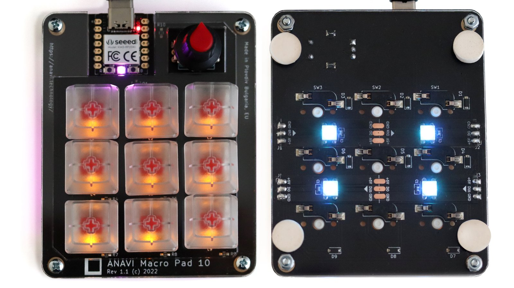

# Matosic Macropad

**Open source programmable keypad with 9 mechanical switches and a clickable rotary encoder.**

A derivative of [ANAVI Macro Pad 10](https://github.com/AnaviTechnology/anavi-macro-pad-10) by [ANAVI Technology](http://www.anavi.technology), redesigned around a Seeeduino XIAO module socket and migrated to KiCad 10. Released under the same Creative Commons Attribution-ShareAlike 4.0 International License (CC-BY-SA-4.0) as the upstream — see [LICENSE](LICENSE).

## Hardware

- 9× Cherry MX (Kailh hot-swap sockets) wired as a 3×3 matrix with per-key 1N4148 anti-ghosting diodes
- 1× clickable EC11 rotary encoder
- **Seeeduino XIAO module socket** — supports any XIAO variant (XIAO RP2040 recommended). USB-C connector and microcontroller live on the XIAO, not on this PCB.
- 9× per-key 1206 SMD LED backlight (single on/off, driven via SOT-23 NPN — not WS2812B)
- 4× 1×3 expansion headers (only J1 carries signal — `R10 → board.D10`; J2/J3/J4 are +5V/GND power taps)
- Designed in KiCad 10 (migrated from the upstream KiCad 5 source)

## Companion firmware

CircuitPython firmware lives in a separate repo: <https://github.com/matosichrvoje/matosic-macropad-firmware>

XIAO pin map for the 3×3 matrix scan and LED chain is documented in [firmware-pinout.md](firmware-pinout.md).

## Case

OpenSCAD sources plus ready-to-print STL/STEP exports live under [case/](case/). Re-export from the `.scad` files after any edit.

## Manufacturing

Target fab is JLCPCB; PCBA is optional (only commodity SMT parts on the board, all hand-solderable). The verified BOM with confirmed LCSC part numbers from the v0.0.0.17 fab run is committed at [bom/matosic-macropad-bom.csv](bom/matosic-macropad-bom.csv) — use it as the source of truth instead of relying on JLCPCB's auto-match. Gerbers + CPL are generated locally by the KiCad **Fabrication Toolkit** plugin into `production/` (gitignored).

## Changes from upstream

This is a derivative work. The substantive changes relative to `AnaviTechnology/anavi-macro-pad-10` are:

- KiCad 5 → KiCad 10 project migration (project file, schematic, PCB, library tables)
- Rebrand from "ANAVI Macro Pad 10" to "Matosic Macropad" — new silkscreen artwork and logo footprint at [components/logo.pretty/matosic-logo.kicad_mod](components/logo.pretty/matosic-logo.kicad_mod). The original Anavi logo footprint is retained at [components/logo.pretty/anavi-logo.kicad_mod](components/logo.pretty/anavi-logo.kicad_mod) for provenance.
- Verified LCSC part numbers for JLCPCB PCBA in [bom/matosic-macropad-bom.csv](bom/matosic-macropad-bom.csv); fab learnings and corrections documented in [CLAUDE.md](CLAUDE.md)
- Renamed all KiCad project files from `anavi-macro-pad-10.*` to `matosic-macropad.*`

The 3×3 switch matrix, encoder wiring, LED-chain topology (single NPN driving 9 LEDs from one GPIO), Kailh hot-swap socket footprint, Seeeduino XIAO module socket footprint, and the case design are inherited from the upstream design.

## Repository files

- `matosic-macropad.kicad_pro`, `matosic-macropad.kicad_pcb`, `matosic-macropad.kicad_sch` — active KiCad 10 project
- `matosic-macropad.sch`, `matosic-macropad.pro`, `matosic-macropad-cache.lib` — pre-migration KiCad 5 backups, kept for safety
- [components/](components/) — bundled footprint/symbol libraries (keyswitches, LEDs, XIAO, logos)
- [case/](case/) — OpenSCAD case sources + STL/STEP exports
- [bom/](bom/) — verified BOM with LCSC part numbers
- [firmware-pinout.md](firmware-pinout.md) — authoritative XIAO pin map for the firmware repo

## Credits

- **Lead:** Hrvoje Matosic
- **Contributors:** Jorge Ochoa, Iván Aceves, Iván Estevez
- **Upstream design:** [ANAVI Technology](http://www.anavi.technology) — *ANAVI Macro Pad 10*, the original work this project is derived from.

## License

This project is released under the [Creative Commons Attribution-ShareAlike 4.0 International (CC-BY-SA-4.0)](https://creativecommons.org/licenses/by-sa/4.0/) license, matching the upstream. The full license text and attribution notice are in [LICENSE](LICENSE).

If you remix or build on this design, you must:

1. **Attribute** Hrvoje Matosic and link back to this repository.
2. **Attribute** the upstream project — [ANAVI Macro Pad 10](https://github.com/AnaviTechnology/anavi-macro-pad-10) by [anavi.technology](http://www.anavi.technology) — as the original design.
3. **ShareAlike** — license your derivative under CC-BY-SA-4.0 (or a BY-SA-compatible license).
4. Indicate what you changed relative to this repo.
